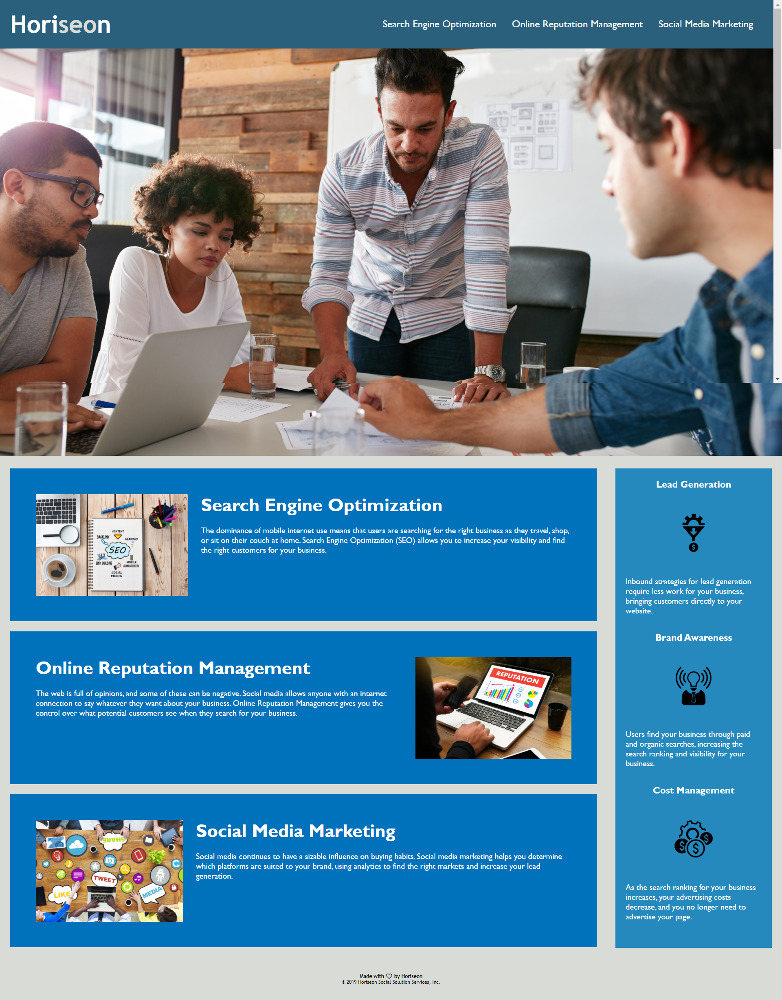

# Horiseon Refactor

## Description

Task: To refactor existing website code in order to improve user accessiblity.

Without changing the actions of the existing code, **"clean"** the codebase to:
- meet accessibility standards ie. semantic HTML
- ensure code sustainability ie. relevant commenting, consolidated CSS and working Links

By following and meeting accessiblity standards, the refactored website will be:
- search engine optimised ie. rank higher
- accessible to people with disabilities (thereby avoiding possible litigation)
#
## What I learned
During the completion of this task, I learned:
- How to compose a README file using Markdown
- How to add a screenshot to the README file
- How the 'scan' element works
- How the 'a' element links work
- About Descendant Selectors
#
## Steps Taken

- #### Step 1 - Create draft README content

- #### Step 2 - HTML Initial Review
        Working from the top down, looked for obvious issues. Examples:
            - Title not descriptive
            - No header element
            - Uncessary spaces
            - Images without alt tags
            - Footer header not html semantic
            - Excessive use of div elements

- #### Step 3 - CSS Initial Review
        Working from the top down, looking for obvious issues. Examples:
            - No comments for the different types of selectors
            - Excessive, Repetative and Redundant Class Selectors

- #### Step 4 - HTML & CSS Indepth Review and Changes - Header

- #### Step 5 - HTML & CSS Indepth Review and Changes - Main Content

- #### Step 6 - HTML & CSS Indepth Review and Changes - SideBar

- #### Step 7 - HTML & CSS Indepth Review and Changes - Footer

- #### Step 8 - HTML & CSS Final Review and Changes - Spacing and Commenting

- #### Step 9 - Update and complete README content

#
[Click here to view Horiseon Website](https://michelledwoods1.github.io/Horiseon-Refactoring/)
#
